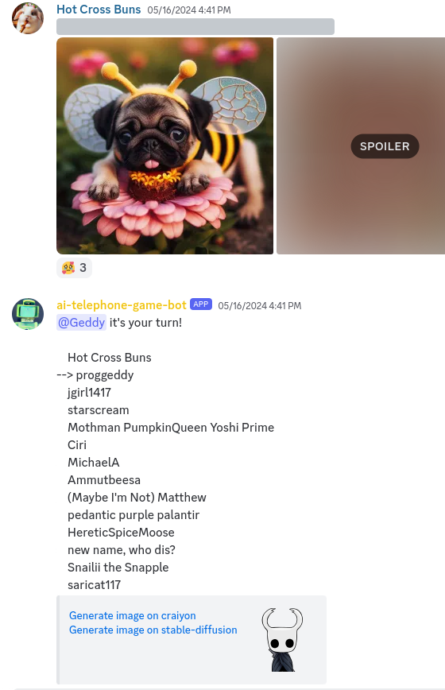
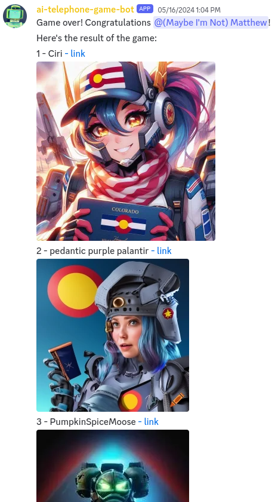

# discord-game-turn-bot

Welcome to Discord AI Telephone, a twist on the classic game of Telephone!

In this game, the fun starts when the first player generates an AI-generated image based on a secret prompt. Then, the next player tries to guess the prompt and responds with their own AI-generated image. The game continues as each player tries to interpret the previous image, leading to hilarious and unexpected results.

At the end of the game, all images are displayed in order, revealing how the original prompt transformed throughout the game.

--- 

## Game Progression

The game progresses as follows:

1. The game is started using the `/begin` command, which shuffles the player list and prints the first player.

2. The current player will simply post an image to the channel and the ai-telephone-bot will auto-detect the players turn. Only one image is required but players are encouraged to put in the prompt with spoiler tags and post a spoiler tagged 2nd image of all images returned from the ai-generation.

3. When the current player is the last player in the list, a message is sent indicating that the game has ended.

### Screenshot showing automatic game progression:


### Screenshot showing end of game


## Commands

- `/add <name>`: Adds a player to the game. If the game is active, the player is added to the end of the list.
- `/begin`: Shuffles the player list and starts a new game.
- `/config`: Displays the current configuration of the bot.
- `/dance`: Displays a dancing emoji.
- `/end`: Ends the current game.
- `/listen`: Sets the current channel for the game to listen to.
- `/print`: Prints the current game status.
- `/remove <name>`: Removes a player from the game.
- `/silent`: Toggles if mentioning (@) is used during turns.
- `/skip`: Skips over the current player.

## Discord Bot

This is a Discord bot written in Python. It uses the `discord.py` library to interact with the Discord API. The bot is initialized with the `commands.Bot` class, which allows it to respond to `/` commands.

## Usage

1. Install the required dependencies: `discord.py`, `asyncio`, `json`, and `random`.
2. Replace the `TOKEN` variable with your bot's token.
3. Run the script: `python bot.py`

## File Structure

- `discordbot.py` - main script, defines commands
- `classes/gamestate.py` - serializable game state object, game actions, and printouts (including to Discord)
- `players.json` - file containing a list of players in the game
- `gamestate.json` - file containing the prior game state, saved on change

## Docker

```bash
docker build -t ai-telephone-bot .
docker run -d -t --name ai-telephone-bot --restart always ai-telephone-bot:latest
docker logs -f ai-telephone-bot
```

```bash
docker exec -it ai-telephone-bot /bin/bash
```

If you have any questions or need further assistance, feel free to ask!
